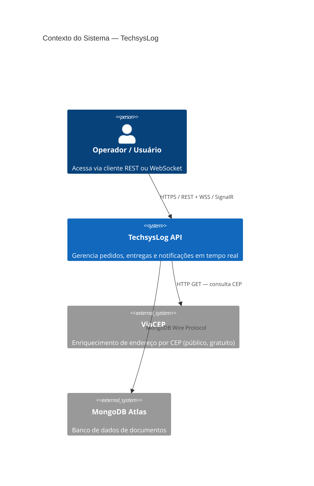
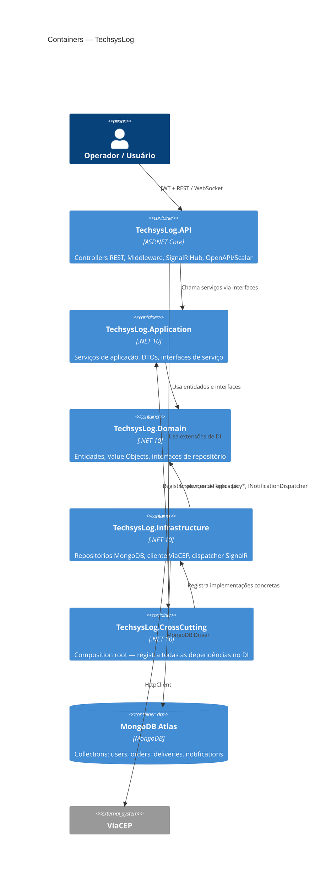
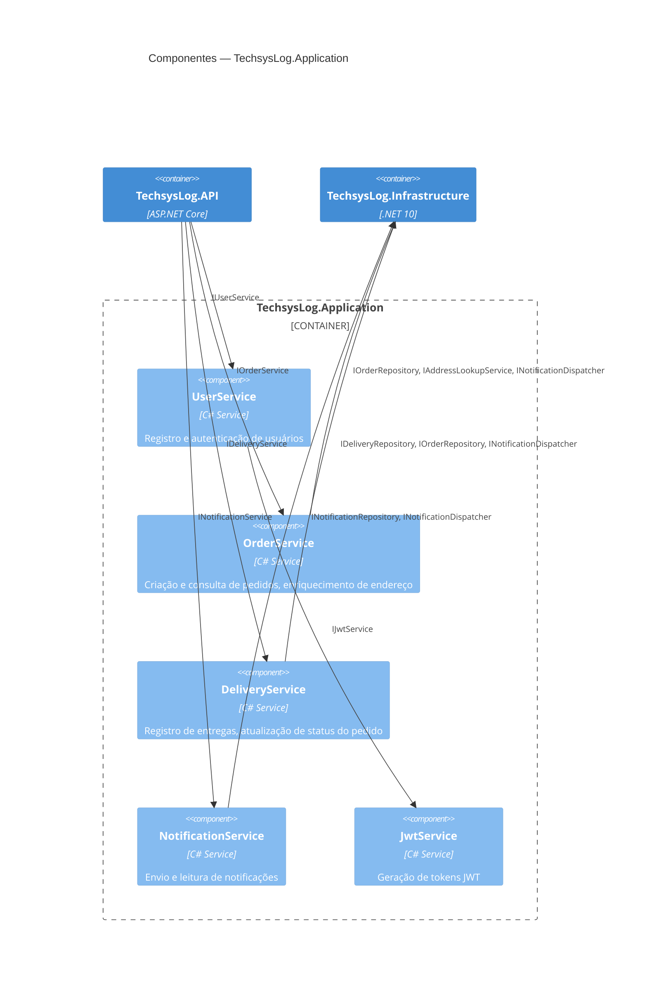

# TechsysLog

API REST para gerenciamento de pedidos e entregas em contexto logístico, desenvolvida como desafio técnico em **C# com .NET 10**, **ASP.NET Core**, **MongoDB** e **SignalR**.

> 🇬🇧 [English summary](#english-summary) available at the bottom of this document.

---

## Números

| | |
|---|---|
| 🏗️ Camadas arquiteturais | 4 |
| ✅ Testes automatizados | 61 |
| 📋 ADRs documentadas | 4 |
| 🔐 Endpoints protegidos por JWT | 100% |

---

## Stack

| Categoria | Tecnologia |
|-----------|-----------|
| Runtime | .NET 10 / ASP.NET Core |
| Banco de dados | MongoDB (`MongoDB.Driver`) |
| Tempo real | SignalR (WebSockets) |
| Autenticação | JWT (`System.IdentityModel.Tokens.Jwt`) |
| Testes | xUnit + Moq + FluentAssertions |
| Documentação | OpenAPI + Scalar UI |

---

## Índice

- [Sobre](#sobre)
- [Decisões de Arquitetura (ADRs)](#decisões-de-arquitetura-adrs)
- [Diagrama C4](#diagrama-c4)
- [Estrutura do Projeto](#estrutura-do-projeto)
- [Como Executar](#como-executar)
- [Testes](#testes)
- [Observabilidade](#observabilidade)
- [Resiliência](#resiliência)
- [Evolução Futura](#evolução-futura)
- [Endpoints](#endpoints)
- [O que Ficou de Fora](#o-que-ficou-de-fora)
- [English Summary](#english-summary)

---

## Sobre

Sistema para a empresa de logística **TechsysLog** gerenciar pedidos, registrar entregas e notificar usuários em tempo real. O backend expõe uma API REST protegida por autenticação JWT, integra com a API pública **ViaCEP** para enriquecimento automático de endereços, e usa **SignalR** para transmitir notificações sempre que um pedido ou entrega é registrado.

O projeto foi construído seguindo os princípios de **Clean Architecture** com separação estrita de camadas, inversão de dependência via projeto CrossCutting dedicado, e foco em testabilidade e decisões de design documentadas.

---

## Decisões de Arquitetura (ADRs)

> Architecture Decision Records (ADRs) documentam as decisões técnicas relevantes, seu contexto e consequências. O formato segue a proposta de [Michael Nygard](https://cognitect.com/blog/2011/11/15/documenting-architecture-decisions).

<details>
<summary><strong>### ADR-001 — MongoDB sobre SQL</strong></summary>

**Status:** Aceito

**Contexto**
O domínio é centrado em documentos: pedidos contêm endereços embutidos, notificações têm ciclo de vida próprio, e os modelos de leitura e escrita raramente diferem. Um banco relacional exigiria joins desnecessários para recuperar um pedido com seu endereço.

**Decisão**
Usar MongoDB com `MongoDB.Driver` diretamente, sem a camada de abstração do EF Core. Indexes são definidos em código (`MongoDbContext`) para garantir configuração correta em qualquer ambiente.

**Consequências**
+ Modelo de documento alinha-se naturalmente com as entidades do domínio
+ Queries tipadas via `Builders<T>` são refactor-safe — renomear uma propriedade gera erro de compilação, não falha silenciosa em runtime
+ Sem migrations — schema evolui junto com o código
− Sem suporte nativo a transações ACID entre coleções (não necessário neste escopo)
− Equipes familiarizadas apenas com SQL têm curva de aprendizado maior

---
</details>

<details>
<summary><strong>### ADR-002 — SignalR sobre polling</strong></summary>

**Status:** Aceito

**Contexto**
Notificações de criação de pedido e registro de entrega precisam chegar ao cliente com baixa latência. Polling HTTP geraria carga desnecessária no servidor e latência variável.

**Decisão**
Usar SignalR com WebSockets como transporte primário. A abstração `INotificationDispatcher` isola o transporte na camada de Infrastructure — a camada Application nunca referencia SignalR diretamente.

**Consequências**
+ Notificações em tempo real sem overhead de polling
+ Trocar SignalR por outro mecanismo (SSE, Kafka consumer, etc.) requer apenas nova implementação de `INotificationDispatcher`, sem mudanças nos serviços
− Requer conexão persistente (WebSocket), que pode ser limitada em alguns ambientes de hospedagem
− Broadcast para todos os clientes conectados neste escopo — evolução natural seria SignalR Groups para targeting por usuário

---
</details>

<details>
<summary><strong>### ADR-003 — Número de pedido sequencial sobre GUID</strong></summary>

**Status:** Aceito

**Contexto**
Pedidos precisam ser identificados em comunicações entre clientes e equipe de suporte. GUIDs são tecnicamente únicos, mas inutilizáveis em contexto operacional ("pode me passar o pedido `3f2504e0-4f89...`?").

**Decisão**
Números de pedido no formato `ORD-00001` gerados sequencialmente via `CountAsync() + 1`. O MongoDB ObjectId continua sendo o identificador interno usado nas rotas REST.

**Consequências**
+ Números legíveis e memorizáveis para operações e suporte
+ Rotas protegidas por JWT com filtro por `UserId` previnem ataques de enumeração
− Em cenário de alta concorrência, `CountAsync() + 1` pode gerar colisões — a solução correta seria um counter atômico via `$inc` no MongoDB ou sequence generator dedicado

---
</details>

<details>
<summary><strong>### ADR-004 — CQRS rejeitado</strong></summary>

**Status:** Rejeitado

**Contexto**
CQRS foi avaliado dado o uso de MongoDB, que se presta naturalmente a modelos de leitura otimizados separados dos modelos de escrita.

**Decisão**
CQRS não foi implementado. Os métodos de serviço atuais são simples o suficiente para não justificar a separação de Commands e Queries com seus respectivos Handlers e o overhead de infraestrutura associado.

**Consequências**
+ Código mais simples e direto para o escopo atual
+ Menor barreira de entrada para novos desenvolvedores
− Se os modelos de leitura e escrita divergirem significativamente em uma evolução futura, refatorar para CQRS exigirá mais esforço do que adotá-lo desde o início

---
</details>

## Diagrama C4

> Os diagramas abaixo são renderizados nativamente pelo GitHub (Mermaid). Para exportar como PNG e incorporar como imagem estática, cole o bloco desejado no [Mermaid Live Editor](https://mermaid.live) e use **Actions → PNG**.

### Nível 1 — Contexto



### Nível 2 — Containers



### Nível 3 — Componentes (Application)



---

## Estrutura do Projeto

```
TechsysLog/
├── TechsysLog.sln
│
├── TechsysLog.Domain/
│   ├── Entities/          — User, Order, Delivery, Notification
│   ├── ValueObjects/      — Address (imutável, igualdade por valor)
│   ├── Enums/             — OrderStatus
│   └── Interfaces/        — IRepository*, INotificationDispatcher, IAddressLookupService
│
├── TechsysLog.Application/
│   ├── DTOs/              — Requests e Responses
│   ├── Services/          — UserService, OrderService, DeliveryService, NotificationService, JwtService
│   ├── Interfaces/        — Contratos de serviço
│   └── Settings/          — JwtSettings
│
├── TechsysLog.Infrastructure/
│   ├── Context/           — MongoDbContext (indexes definidos em código)
│   ├── Repositories/      — UserRepository, OrderRepository, DeliveryRepository, NotificationRepository
│   ├── ExternalServices/  — ViaCepClient (ViaCepResponseDto é internal)
│   └── WebSockets/        — SignalRNotificationDispatcher, NotificationHub
│
├── TechsysLog.CrossCutting/
│   └── DependencyInjection.cs — Composition root: único ponto que conhece todas as camadas
│
├── TechsysLog.API/
│   ├── Controllers/       — AuthController, OrdersController, DeliveriesController, NotificationsController
│   ├── Middleware/        — ExceptionHandlingMiddleware (tratamento global de erros)
│   └── Program.cs         — Configuração da aplicação, OpenAPI/Scalar, JWT, SignalR
│
└── TechsysLog.Tests/
    ├── Builders/          — UserBuilder, OrderBuilder, NotificationBuilder (padrão Builder para dados de teste)
    ├── Controllers/       — Testes dos 4 controllers com ClaimsPrincipal injetado
    └── Services/          — Testes dos 4 serviços de aplicação com Moq
```

---

## Como Executar

### Pré-requisitos

- [.NET 10 SDK](https://dot.net)
- [Git](https://git-scm.com)
- Cluster [MongoDB Atlas](https://www.mongodb.com/atlas) gratuito (M0) ou instância local

### Passos

**1. Clonar o repositório**

```bash
git clone https://github.com/seu-usuario/TechsysLog.git
cd TechsysLog
```

**2. Configurar segredos locais**

```bash
dotnet user-secrets init --project TechsysLog.API

dotnet user-secrets set "MongoDb:ConnectionString" "sua-connection-string" --project TechsysLog.API
dotnet user-secrets set "Jwt:Secret" "sua-chave-secreta-minimo-32-caracteres" --project TechsysLog.API
```

> O banco de dados e as collections são criados automaticamente na primeira escrita. Não é necessária configuração manual no Atlas.

**3. Executar a API**

```bash
dotnet run --project TechsysLog.API
```

**4. Acessar a documentação**

Abra no navegador: `https://localhost:{porta}/scalar/v1`

A interface Scalar lista todos os endpoints com schemas de request/response e suporta autenticação JWT diretamente na interface.

---

## Testes

### Executar

```bash
dotnet test
```

O coverage é gerado automaticamente em `coverage.cobertura.xml` na raiz do projeto (configurado via `TechsysLog.Tests.csproj`).

### Visualizar cobertura inline no VS Code

1. Instale a extensão [Coverage Gutters](https://marketplace.visualstudio.com/items?itemName=ryanluker.vscode-coverage-gutters)
2. `Cmd+Shift+P` → `Coverage Gutters: Watch`
3. As linhas cobertas/não cobertas aparecem no gutter de qualquer arquivo `.cs` aberto

### Qualidade:

| | |
|---|---|
| Testes automatizados | 61 |
| Cobertura — Application (linha) | 98.2% |
| Cobertura — API (linha) | 100% |
| Cobertura — Domain (linha) | 100% |
| Stack de testes | xUnit + Moq + FluentAssertions |

### Confiabilidade e Estratégia de Testes

O middleware global de tratamento de exceções foi testado intencionalmente com base nas ideias discutidas no artigo:

Yuan et al. — "Simple Testing Can Prevent Most Critical Failures"

O estudo demonstra que falhas no tratamento de erros estão entre as principais causas de incidentes catastróficos em sistemas de software.

Por esse motivo, todas as ramificações de exceção do middleware possuem cobertura automatizada, validando:

- mapeamento correto para os respectivos códigos HTTP;
- respostas seguras para o cliente;
- ausência de vazamento de detalhes internos da aplicação;
- registro obrigatório dos erros em log;
- preservação do fluxo normal de execução (happy path).

O objetivo não é apenas aumentar métricas de cobertura, mas reduzir riscos associados ao tratamento incorreto de falhas, reforçando requisitos de confiabilidade, observabilidade e segurança.

| Camada | Abordagem |
|--------|-----------|
| Application services | Testes unitários com Moq — `UserService`, `OrderService`, `DeliveryService`, `NotificationService` |
| API controllers | Testes unitários com `ClaimsPrincipal` injetado — simula autenticação JWT sem pipeline HTTP completo |
| Builder pattern | `UserBuilder`, `OrderBuilder`, `NotificationBuilder` — dados de teste consistentes sem repetição |
| Infrastructure | Não coberta por testes unitários — repositórios são mais adequados para testes de integração contra banco real |

### Cobertura por camada

| Camada | Linha | Branch | Método | Observação |
|--------|-------|--------|--------|------------|
| Application | 98.2% | 95.5% | 95.7% | Services — core do negócio |
| API | 100% | 93.8% | 100% | Controllers + `ExceptionHandlingMiddleware` |
| Domain | 100% | 100% | 100% | Entidades e `Address` value object |
| Infrastructure | excluída | — | — | Candidata a testes de integração |
| CrossCutting | excluída | — | — | DI composition root — sem lógica testável |

---

## Observabilidade

<details>
<summary>Implementado + próximos passos recomendados</summary>

### Implementado

| Mecanismo | Implementação |
|-----------|--------------|
| **Logging estruturado** | `ILogger<T>` injetado nos serviços; logs com nível (`Information`, `Warning`, `Error`) e parâmetros nomeados (`{ZipCode}`, `{OrderId}`) |
| **Tratamento global de erros** | `ExceptionHandlingMiddleware` intercepta todas as exceções não tratadas e retorna respostas padronizadas com `statusCode` e `message` — stack traces nunca vazam para o cliente |
| **Log de degradação** | Falhas no ViaCEP são registradas como `LogWarning` com contexto completo — sem interrupção do fluxo principal |

### Próximos passos recomendados

**Correlation ID**
Middleware que injeta um `X-Correlation-Id` em cada request e o propaga nos logs — essencial para rastrear uma requisição entre múltiplos serviços ou em análise de logs centralizados (Datadog, Elastic).

```csharp
app.Use(async (context, next) => {
    var correlationId = context.Request.Headers["X-Correlation-Id"]
        .FirstOrDefault() ?? Guid.NewGuid().ToString();
    context.Items["CorrelationId"] = correlationId;
    context.Response.Headers["X-Correlation-Id"] = correlationId;
    using (logger.BeginScope(new Dictionary<string, object> {
        ["CorrelationId"] = correlationId }))
    {
        await next();
    }
});
```

**OpenTelemetry**
A arquitetura está preparada para adoção de OpenTelemetry sem mudanças nas camadas de domínio ou aplicação:

```bash
dotnet add package OpenTelemetry.Extensions.Hosting
dotnet add package OpenTelemetry.Instrumentation.AspNetCore
dotnet add package OpenTelemetry.Instrumentation.Http
dotnet add package OpenTelemetry.Exporter.Otlp  # Datadog, Jaeger, Grafana Tempo, etc.
```

```csharp
builder.Services.AddOpenTelemetry()
    .WithTracing(tracing => tracing
        .AddAspNetCoreInstrumentation()
        .AddHttpClientInstrumentation()
        .AddMongoDBInstrumentation()
        .AddOtlpExporter())
    .WithMetrics(metrics => metrics
        .AddAspNetCoreInstrumentation()
        .AddRuntimeInstrumentation()
        .AddOtlpExporter());
```

**Health Checks**
```csharp
builder.Services.AddHealthChecks()
    .AddMongoDb(connectionString, name: "mongodb", tags: ["ready"]);

app.MapHealthChecks("/health");
app.MapHealthChecks("/health/ready", new HealthCheckOptions {
    Predicate = check => check.Tags.Contains("ready")
});
```

**Métricas de negócio**
Contadores e histogramas via `System.Diagnostics.Metrics` (nativo no .NET) para métricas relevantes: pedidos criados por minuto, tempo de resposta do ViaCEP, taxa de falha de enriquecimento de endereço.

</details>

---

## Resiliência

<details>
<summary>Implementado + próximos passos recomendados</summary>

### Implementado

| Padrão | Implementação |
|--------|--------------|
| **Graceful degradation** | Falha no ViaCEP não interrompe a criação do pedido — o endereço fornecido pelo usuário é usado como fallback |
| **Failure isolation** | `ExceptionHandlingMiddleware` garante que exceções não tratadas não vazam stack traces para o cliente |
| **Logging de falha contextualizado** | Erros em dependências externas são logados com contexto completo (`ZipCode`, tipo da exceção) sem propagar para o chamador |

### Próximos passos recomendados

**Retry + Circuit Breaker com Polly para o ViaCEP**

```bash
dotnet add package Microsoft.Extensions.Http.Resilience
```

```csharp
builder.Services.AddHttpClient<IAddressLookupService, ViaCepClient>(client => {
    client.BaseAddress = new Uri(configuration["ViaCep:BaseUrl"] ?? "https://viacep.com.br/ws/");
})
.AddResilienceHandler("viacep", pipeline => {
    pipeline.AddRetry(new HttpRetryStrategyOptions {
        MaxRetryAttempts = 3,
        Delay = TimeSpan.FromMilliseconds(200),
        BackoffType = DelayBackoffType.Exponential,
        ShouldHandle = new PredicateBuilder<HttpResponseMessage>()
            .Handle<HttpRequestException>()
            .HandleResult(r => (int)r.StatusCode >= 500)
    });
    pipeline.AddCircuitBreaker(new HttpCircuitBreakerStrategyOptions {
        SamplingDuration = TimeSpan.FromSeconds(30),
        FailureRatio = 0.5,
        MinimumThroughput = 5,
        BreakDuration = TimeSpan.FromSeconds(15)
    });
    pipeline.AddTimeout(TimeSpan.FromSeconds(3));
});
```

**Cache de CEP com Redis**
CEPs raramente mudam — cachear respostas do ViaCEP reduz latência e desacopla o sistema do serviço externo:

```csharp
// Decorator de IAddressLookupService com cache distribuído
public class CachedAddressLookupService(
    IAddressLookupService inner,
    IDistributedCache cache) : IAddressLookupService
{
    private static readonly TimeSpan Ttl = TimeSpan.FromDays(7);

    public async Task<Address?> GetAddressByZipCodeAsync(string zipCode)
    {
        var cached = await cache.GetStringAsync($"cep:{zipCode}");
        if (cached is not null)
            return JsonSerializer.Deserialize<Address>(cached);

        var address = await inner.GetAddressByZipCodeAsync(zipCode);
        if (address is not null)
            await cache.SetStringAsync($"cep:{zipCode}",
                JsonSerializer.Serialize(address),
                new DistributedCacheEntryOptions {
                    AbsoluteExpirationRelativeToNow = Ttl
                });

        return address;
    }
}
```

O padrão Decorator mantém o `ViaCepClient` sem modificações e o cache é registrado no DI sem que nenhuma outra camada precise saber que ele existe.

</details>

---

## Evolução Futura

<details>
<summary>Arquitetura orientada a eventos — contexto, padrões e tecnologias avaliadas</summary>

### Arquitetura orientada a eventos

A arquitetura atual usa SignalR para notificações síncronas ponto-a-ponto. Uma evolução natural para escala seria mover para um modelo orientado a eventos com broker de mensagens:

```
Pedido criado
    └── OrderCreatedEvent publicado no broker (Kafka / RabbitMQ)
          ├── NotificationService consome → persiste e transmite via SignalR
          ├── EmailService consome → envia e-mail de confirmação (futuro)
          └── AnalyticsService consome → atualiza dashboard em tempo real (futuro)
```

**Outbox Pattern**
Garante consistência entre a escrita no banco e a publicação do evento — sem risco de mensagem perdida em caso de falha entre os dois:

```
Transação atômica:
  1. Salvar Order no MongoDB
  2. Salvar OutboxMessage { event: "OrderCreated", payload: {...}, processedAt: null }

Worker em background:
  3. Ler OutboxMessages não processadas
  4. Publicar no broker
  5. Marcar como processada (processedAt = now)
```

**Considerações sobre Event Sourcing**
O domínio de pedidos e entregas tem histórico imutável por natureza (`Pending → Shipped → Delivered`). Event Sourcing seria apropriado se o histórico completo de transições de estado se tornasse um requisito de negócio explícito — mas aumenta significativamente a complexidade operacional e seria prematuro neste escopo.

**Tecnologias avaliadas**

| Tecnologia | Caso de uso |
|------------|-------------|
| **Kafka** | Alto volume, retenção de eventos longa, múltiplos consumers independentes |
| **RabbitMQ** | Roteamento flexível, menor overhead operacional, dead-letter queues nativas |
| **MassTransit** | Abstração sobre Kafka/RabbitMQ, sagas, outbox pattern nativo |
| **Redis Streams** | Alternativa leve se Redis já estiver no stack para cache |

</details>

---

## Endpoints

### Auth

| Método | Rota | Auth | Descrição |
|--------|------|------|-----------|
| `POST` | `/api/auth/register` | ✗ | Registra novo usuário |
| `POST` | `/api/auth/login` | ✗ | Autentica e retorna token JWT |

### Pedidos

| Método | Rota | Auth | Descrição |
|--------|------|------|-----------|
| `POST` | `/api/orders` | ✓ | Cria pedido. Endereço é enriquecido automaticamente via ViaCEP |
| `GET` | `/api/orders` | ✓ | Lista pedidos do usuário autenticado |
| `GET` | `/api/orders/{id}` | ✓ | Retorna pedido por MongoDB ObjectId |
| `GET` | `/api/orders/number/{orderNumber}` | ✓ | Retorna pedido por número legível (ex: `ORD-00001`) |

### Entregas

| Método | Rota | Auth | Descrição |
|--------|------|------|-----------|
| `POST` | `/api/deliveries` | ✓ | Registra entrega. Atualiza status do pedido para `Delivered` automaticamente |
| `GET` | `/api/deliveries/{orderId}` | ✓ | Retorna entrega de um pedido específico |

### Notificações

| Método | Rota | Auth | Descrição |
|--------|------|------|-----------|
| `GET` | `/api/notifications` | ✓ | Retorna todas as notificações |
| `GET` | `/api/notifications/unread` | ✓ | Retorna apenas notificações não lidas |
| `PATCH` | `/api/notifications/{id}/read` | ✓ | Marca notificação como lida para o usuário autenticado |

### Exemplo — Criar pedido

**Request**
```json
POST /api/orders
Authorization: Bearer {token}

{
  "description": "Notebook Dell XPS",
  "amount": 8500.00,
  "deliveryAddress": {
    "zipCode": "01310-100",
    "number": "1578",
    "street": "",
    "neighborhood": "",
    "city": "",
    "state": ""
  }
}
```

**`201 Created`**
```json
{
  "id": "6a2a344d034b3271f27a233c",
  "orderNumber": "ORD-00001",
  "description": "Notebook Dell XPS",
  "amount": 8500.00,
  "deliveryAddress": {
    "zipCode": "01310-100",
    "street": "Avenida Paulista",
    "number": "1578",
    "neighborhood": "Bela Vista",
    "city": "São Paulo",
    "state": "SP"
  },
  "status": 0,
  "userId": "6a29ccb85c6f09702e1853de",
  "createdAt": "2026-06-11T04:06:37.701Z"
}
```

**`409 Conflict`** — entrega duplicada
```json
{ "statusCode": 409, "message": "Order ORD-00001 has already been delivered." }
```

**`404 Not Found`**
```json
{ "statusCode": 404, "message": "Order 6a2a344d034b3271f27a233c not found." }
```

### Notificações em tempo real (SignalR)

Conecte ao hub em `/hubs/notifications` passando o JWT como query string:

```
wss://localhost:{porta}/hubs/notifications?access_token={token}
```

Escute o evento `ReceiveNotification` para receber atualizações em tempo real sempre que um pedido é criado ou uma entrega é registrada.

---

## O que Ficou de Fora

| Item | Motivo |
|------|--------|
| **Frontend** | Entregue como fase separada após conclusão do backend. React + Next.js é a implementação planejada |
| **Refresh tokens** | Expiração JWT configurada em 1 hora. Refresh tokens adicionam complexidade fora do escopo deste desafio |
| **SignalR por usuário** | Notificações são broadcast para todos os clientes conectados. Targeting por usuário exigiria SignalR Groups — documentado como próximo passo natural |
| **Paginação** | Não implementada dado o volume de dados esperado no contexto do desafio. A arquitetura suporta adição sem breaking changes |
| **Docker** | Não exigido pelo desafio, mas a arquitetura suporta containerização sem mudanças em nenhuma camada |
| **Testes de integração** | Infrastructure excluída da cobertura unitária. Testes de integração contra MongoDB real seriam o próximo passo para validar corretude das queries |
| **CQRS** | Avaliado e rejeitado para este escopo — ver [ADR-004](#adr-004--cqrs-rejeitado) |
| **Retry / Circuit Breaker** | ViaCEP já tem graceful degradation. Polly com retry exponencial e circuit breaker é o próximo passo — ver [Resiliência](#resiliência) |

---

## English Summary

REST API for order and delivery management in a logistics context, built as a technical challenge using **C# with .NET 10**, **ASP.NET Core**, **MongoDB**, and **SignalR**.

### Architecture

The solution follows **Clean Architecture** with four independent layers: **Domain** (entities, value objects, repository interfaces — no external dependencies), **Application** (services, DTOs, service interfaces), **Infrastructure** (MongoDB repositories, ViaCEP HTTP client, SignalR dispatcher), and **CrossCutting** (the composition root — the only project aware of all layers). The **API** references only Application and CrossCutting, never Infrastructure directly.

Key decisions documented as ADRs: MongoDB over SQL (document model fits the domain naturally — [ADR-001](#adr-001--mongodb-sobre-sql)), SignalR over polling with transport abstraction via `INotificationDispatcher` ([ADR-002](#adr-002--signalr-sobre-polling)), sequential order numbers (`ORD-00001`) over GUIDs for operational readability ([ADR-003](#adr-003--número-de-pedido-sequencial-sobre-guid)), and CQRS rejected as premature for this scope ([ADR-004](#adr-004--cqrs-rejeitado)).

### Running

```bash
git clone https://github.com/your-username/TechsysLog.git
cd TechsysLog
dotnet user-secrets set "MongoDb:ConnectionString" "your-connection-string" --project TechsysLog.API
dotnet user-secrets set "Jwt:Secret" "your-secret-minimum-32-chars" --project TechsysLog.API
dotnet run --project TechsysLog.API
```

Access the Scalar UI at `https://localhost:{port}/scalar/v1`.

### Tests

```bash
dotnet test  # 61 tests, generates coverage.cobertura.xml automatically
```

Unit tests cover Application services (Moq) and API controllers (injected `ClaimsPrincipal`). Infrastructure is excluded from unit test coverage — integration tests against a real MongoDB instance are the natural next step.
