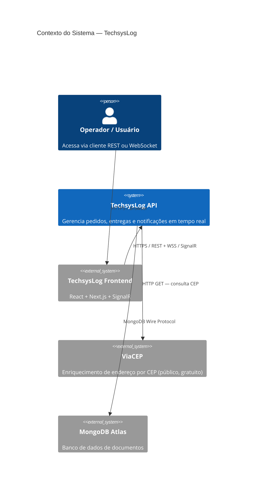
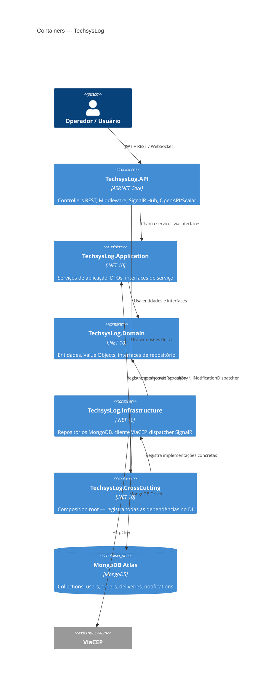
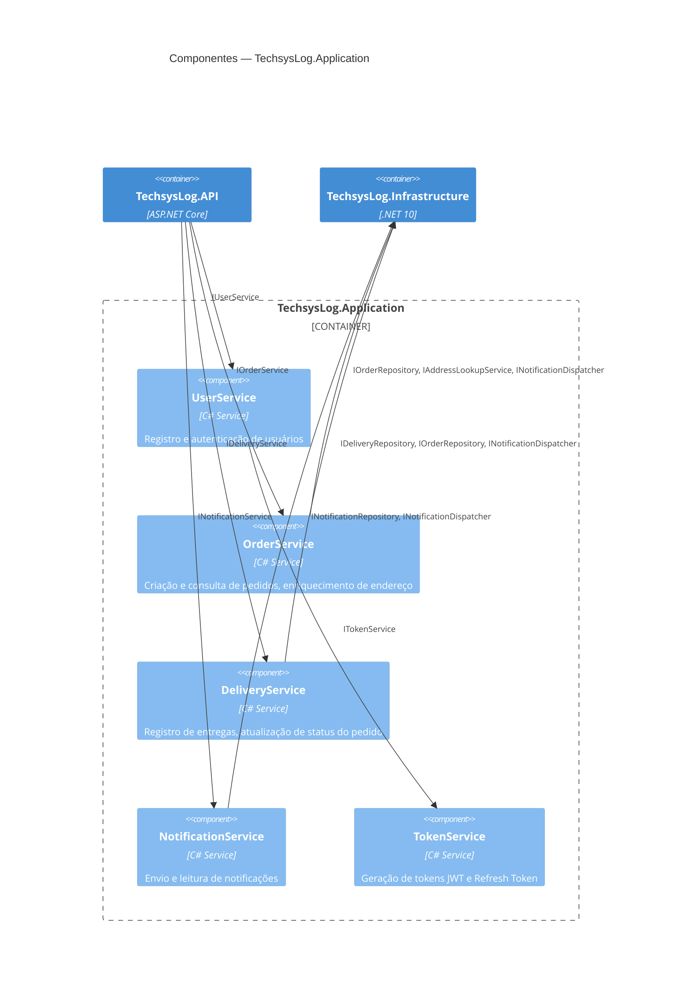
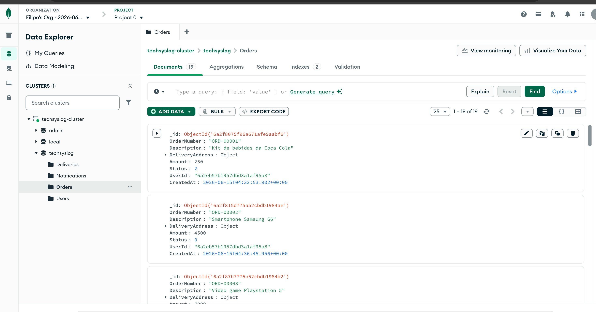

# TechsysLog

API REST para gerenciamento de pedidos e entregas em contexto logístico, desenvolvida como desafio técnico em **C# com .NET 10**, **ASP.NET Core**, **MongoDB** e **SignalR**.

> 🇬🇧 [English summary](#english-summary) available at the bottom of this document.

---

## Números

|                                            |                      |
| ------------------------------------------ | -------------------- |
| 🏗️ Camadas arquiteturais                   | 4 (+ API entrypoint) |
| ✅ Testes automatizados                    | 67                   |
| 📋 ADRs documentadas                       | 5                    |
| 🔐 Endpoints de domínio protegidos por JWT | 100%                 |

---

## Stack

| Categoria      | Tecnologia                              |
| -------------- | --------------------------------------- |
| Runtime        | .NET 10 / ASP.NET Core                  |
| Banco de dados | MongoDB (`MongoDB.Driver`)              |
| Tempo real     | SignalR (WebSockets)                    |
| Autenticação   | JWT (`System.IdentityModel.Tokens.Jwt`) |
| Testes         | xUnit + Moq + FluentAssertions          |
| Documentação   | OpenAPI + Scalar UI                     |

---

## Repositórios

|                                   |                                                                                                                                              |
| --------------------------------- | -------------------------------------------------------------------------------------------------------------------------------------------- |
| 🔧 **Backend** (este repositório) | API REST, Clean Architecture, MongoDB, SignalR                                                                                               |
| 🖥️ **Frontend**                   | [github.com/filipembraga/TechsysLog-frontend](https://github.com/filipembraga/TechsysLog-frontend) — React + Vite + TanStack Query + SignalR |

---

## Índice

- [Sobre](#sobre)
- [Decisões de Arquitetura (ADRs)](#decisões-de-arquitetura-adrs)
- [Diagrama C4](#diagrama-c4)
- [Estrutura do Projeto](#estrutura-do-projeto)
- [Como Executar](#como-executar)
- [Testes](#testes)
- [Observabilidade](#observabilidade)
- [Resiliência](#resiliência)
- [Evolução Futura](#evolução-futura)
- [Endpoints](#endpoints)
- [O que Ficou de Fora](#o-que-ficou-de-fora)
- [English Summary](#english-summary)

---

## Sobre

Sistema para a empresa de logística **TechsysLog** gerenciar pedidos, registrar entregas e notificar usuários em tempo real. O backend expõe uma API REST protegida por autenticação JWT, integra com a API pública **ViaCEP** para enriquecimento automático de endereços, e usa **SignalR** para transmitir notificações sempre que um pedido ou entrega é registrado.

O projeto foi construído seguindo os princípios de **Clean Architecture** com separação estrita de camadas, inversão de dependência via projeto CrossCutting dedicado, e foco em testabilidade e decisões de design documentadas. O cliente frontend está disponível em [TechsysLog-frontend](https://github.com/filipembraga/TechsysLog-frontend).

---

## Decisões de Arquitetura (ADRs)

> Architecture Decision Records (ADRs) documentam as decisões técnicas relevantes, seu contexto e consequências. O formato segue a proposta de [Michael Nygard](https://cognitect.com/blog/2011/11/15/documenting-architecture-decisions).

<details>
<summary><strong>ADR-001 — MongoDB sobre SQL</strong></summary>

**Status:** Aceito

**Contexto**
O domínio é centrado em documentos: pedidos contêm endereços embutidos, notificações têm ciclo de vida próprio, e os modelos de leitura e escrita raramente diferem. Um banco relacional exigiria joins desnecessários para recuperar um pedido com seu endereço.

**Decisão**
Usar MongoDB com `MongoDB.Driver` diretamente, sem a camada de abstração do EF Core. Indexes são definidos em código (`MongoDbContext`) para garantir configuração correta em qualquer ambiente.

**Consequências**

- Modelo de documento alinha-se naturalmente com as entidades do domínio
- Queries tipadas via `Builders<T>` são refactor-safe — renomear uma propriedade gera erro de compilação, não falha silenciosa em runtime
- Sem migrations — schema evolui junto com o código
  − Sem suporte nativo a transações ACID entre coleções (não necessário neste escopo)
  − Equipes familiarizadas apenas com SQL têm curva de aprendizado maior

</details>

<details>
<summary><strong>ADR-002 — SignalR sobre polling</strong></summary>

**Status:** Aceito

**Contexto**
Notificações de criação de pedido e registro de entrega precisam chegar ao cliente com baixa latência. Polling HTTP geraria carga desnecessária no servidor e latência variável.

**Decisão**
Usar SignalR com WebSockets como transporte primário. A abstração `INotificationDispatcher` isola o transporte na camada de Infrastructure — a camada Application nunca referencia SignalR diretamente.

**Consequências**

- Notificações em tempo real sem overhead de polling
- Trocar SignalR por outro mecanismo (SSE, Kafka consumer, etc.) requer apenas nova implementação de `INotificationDispatcher`, sem mudanças nos serviços
  − Requer conexão persistente (WebSocket), que pode ser limitada em alguns ambientes de hospedagem
  − Broadcast para todos os clientes conectados neste escopo — evolução natural seria SignalR Groups para targeting por usuário

</details>

<details>
<summary><strong>ADR-003 — Número de pedido sequencial sobre GUID</strong></summary>

**Status:** Aceito

**Contexto**
Pedidos precisam ser identificados em comunicações entre clientes e equipe de suporte. GUIDs são tecnicamente únicos, mas inutilizáveis em contexto operacional ("pode me passar o pedido `3f2504e0-4f89...`?").

**Decisão**
Números de pedido no formato `ORD-00001` gerados sequencialmente via `CountAsync() + 1`. O MongoDB ObjectId continua sendo o identificador interno usado nas rotas REST.

**Consequências**

- Números legíveis e memorizáveis para operações e suporte
- Rotas protegidas por JWT com filtro por `UserId` previnem ataques de enumeração
  − Em cenário de alta concorrência, `CountAsync() + 1` pode gerar colisões — a solução correta seria um counter atômico via `$inc` no MongoDB ou sequence generator dedicado

</details>

<details>
<summary><strong>ADR-004 — CQRS rejeitado</strong></summary>

**Status:** Rejeitado

**Contexto**
CQRS foi avaliado dado o uso de MongoDB, que se presta naturalmente a modelos de leitura otimizados separados dos modelos de escrita.

**Decisão**
CQRS não foi implementado. Os métodos de serviço atuais são simples o suficiente para não justificar a separação de Commands e Queries com seus respectivos Handlers e o overhead de infraestrutura associado.

**Consequências**

- Código mais simples e direto para o escopo atual
- Menor barreira de entrada para novos desenvolvedores
  − Se os modelos de leitura e escrita divergirem significativamente em uma evolução futura, refatorar para CQRS exigirá mais esforço do que adotá-lo desde o início

</details>

<details>
<summary><strong>ADR-005 — Refresh Token via cookie httpOnly, sem rotação</strong></summary>

**Status:** Aceito

**Contexto**
O Access Token (JWT) tinha validade de 1 hora e ficava exposto via `localStorage` no frontend — vulnerável a XSS, e sem renovação automática. Era necessário separar "prova de identidade de curta duração" de "permissão de sessão de longa duração".

**Decisão**
Access Token reduzido para 15 minutos (configurável via `Jwt:AccessTokenExpirationMinutes`), com claim `iat` padrão (RFC 7519) para auditoria. Refresh Token opaco (256 bits aleatórios, `RandomNumberGenerator`) emitido junto, com hash SHA-256 persistido na collection `RefreshTokens` (nunca o valor puro) e TTL index para expiração automática (7 dias). O valor puro só existe no cookie `httpOnly`, `Secure`, `SameSite=Strict`, restrito ao path `/api/auth/refresh`. `JwtService` foi renomeado para `TokenService`/`ITokenService` — ele emite os dois tipos de token, não só o JWT.

Sem rotação a cada uso: o Refresh Token permanece o mesmo até expirar. `ClockSkew` configurado explicitamente (não o padrão de 5 minutos do `Microsoft.IdentityModel`), valor pequeno e deliberado pensando em múltiplas instâncias (Docker/ECS) com possível drift de relógio.

**Consequências**

- Token de longa duração nunca acessível via JavaScript (mitiga XSS)
- Renovação de sessão sem exigir login a cada 15 minutos
- `TokenHasher` (`Domain/Common`) reutilizável caso outro tipo de token precise de hash no futuro
  − Sem rotação, um Refresh Token comprometido permanece válido até expirar ou logout — rotação com detecção de reuso é a evolução natural se o projeto ganhar usuários reais
  − CSRF mitigado por `SameSite=Strict`, sem CSRF token dedicado — avaliado como suficiente para o escopo atual

</details>

---

## Diagrama C4

> Os diagramas abaixo são renderizados nativamente pelo GitHub (Mermaid). Para exportar como PNG, cole o bloco no [Mermaid Live Editor](https://mermaid.live) e use **Actions → PNG**.

### Nível 1 — Contexto



### Nível 2 — Containers



### Nível 3 — Componentes (Application)



---

## Estrutura do Projeto

```
TechsysLog/
├── TechsysLog.sln
│
├── TechsysLog.Domain/
│   ├── Entities/          — User, Order, Delivery, Notification, RefreshToken
│   ├── ValueObjects/      — Address (imutável, igualdade por valor)
│   ├── Enums/             — OrderStatus
│   ├── Common/            — TokenHasher (hash SHA-256, sem interface — função pura)
│   └── Interfaces/        — IRepository*, INotificationDispatcher, IAddressLookupService, IRefreshTokenRepository
│
├── TechsysLog.Application/
│   ├── DTOs/              — Requests e Responses (UserBaseDto compartilhado entre UserResponseDto e LoginResponseDto)
│   ├── Services/          — UserService, OrderService, DeliveryService, NotificationService, TokenService
│   ├── Interfaces/        — Contratos de serviço
│   └── Settings/          — JwtSettings
│
├── TechsysLog.Infrastructure/
│   ├── Context/           — MongoDbContext (indexes definidos em código, incluindo TTL index em RefreshTokens)
│   ├── Repositories/      — UserRepository, OrderRepository, DeliveryRepository, NotificationRepository, RefreshTokenRepository
│   ├── ExternalServices/  — ViaCepClient (ViaCepResponseDto é internal)
│   └── WebSockets/        — SignalRNotificationDispatcher, NotificationHub
│
├── TechsysLog.CrossCutting/
│   └── DependencyInjection.cs — Composition root: único ponto que conhece todas as camadas
│
├── TechsysLog.API/
│   ├── Controllers/       — AuthController, OrdersController, DeliveriesController, NotificationsController
│   ├── Middleware/        — ExceptionHandlingMiddleware (tratamento global de erros)
│   └── Program.cs         — Configuração da aplicação, OpenAPI/Scalar, JWT, SignalR
│
└── TechsysLog.Tests/
    ├── Builders/          — UserBuilder, OrderBuilder, NotificationBuilder (padrão Builder para dados de teste)
    ├── Controllers/       — Testes dos 4 controllers com ClaimsPrincipal injetado
    └── Services/          — Testes dos 4 serviços de aplicação com Moq
```

---

## Como Executar

### Opção 1 — Docker Compose (recomendado)

Sobe o stack completo (API + frontend + MongoDB local) com um único comando.

**Pré-requisitos**

- [Docker Desktop](https://www.docker.com/products/docker-desktop/)
- Ambos os repositórios clonados como irmãos:
```
Dev/
├── TechsysLog-api/
└── TechsysLog-frontend/
```
**Passos**

```bash
git clone https://github.com/filipembraga/TechsysLog-api.git
# clone o frontend como irmão:
git clone https://github.com/filipembraga/TechsysLog-frontend.git

cd TechsysLog-api
cp .env.example .env
# edite .env e preencha JWT_SECRET com qualquer string de 32+ caracteres

docker compose up --build
```

| Serviço   | URL                             |
| --------- | ------------------------------- |
| Frontend  | http://localhost:3000           |
| API       | http://localhost:8080           |
| Scalar UI | http://localhost:8080/scalar/v1 |

> O banco de dados MongoDB é criado automaticamente com todas as collections e índices na primeira execução.

---

### Opção 2 — API isolada (`dotnet run`)

Para rodar só o backend contra MongoDB Atlas, sem Docker.

**Pré-requisitos**

- [.NET 10 SDK](https://dot.net)
- Cluster [MongoDB Atlas](https://www.mongodb.com/atlas) gratuito (M0)

**Passos**

```bash
git clone https://github.com/filipembraga/TechsysLog-api.git
cd TechsysLog-api

dotnet user-secrets set "MongoDb:ConnectionString" "sua-connection-string" --project TechsysLog.API
dotnet user-secrets set "Jwt:Secret" "sua-chave-secreta-minimo-32-caracteres" --project TechsysLog.API

dotnet run --project TechsysLog.API
```

Acesse a documentação em `https://localhost:{porta}/scalar/v1`.

---

## Testes

### Executar

```bash
dotnet test
```

### Visualizar cobertura inline no VS Code

1. Instale a extensão [Coverage Gutters](https://marketplace.visualstudio.com/items?itemName=ryanluker.vscode-coverage-gutters)
2. Execute `dotnet test` para gerar o relatório de cobertura
3. `Cmd+Shift+P` → `Coverage Gutters: Display Coverage`
4. Linhas cobertas/não cobertas aparecem no gutter de qualquer arquivo `.cs` aberto

### Qualidade

|                                 |                                        |
| ------------------------------- | -------------------------------------- |
| Testes automatizados            | 67                                     |
| Cobertura — Application (linha) | 98.9%                                  |
| Cobertura — API (linha)         | 96.6%                                  |
| Cobertura — Domain (linha)      | 100%                                   |
| Stack de testes                 | xUnit + Moq + FluentAssertions 7 (MIT) |

### Estratégia de testes

O middleware global de tratamento de exceções foi testado intencionalmente com base nas ideias discutidas em:

> Yuan et al. — _"Simple Testing Can Prevent Most Critical Failures"_

O estudo demonstra que falhas no tratamento de erros estão entre as principais causas de incidentes catastróficos em sistemas de software. Por esse motivo, todas as ramificações de exceção do middleware possuem cobertura automatizada, validando mapeamento correto para códigos HTTP, respostas seguras ao cliente, ausência de vazamento de detalhes internos e preservação do fluxo normal de execução.

#### Saúde da suíte de testes

A suíte passou por uma auditoria deliberada (75 → 67 testes) com dois movimentos distintos, não um simples corte:

- **Remoção** de testes que validavam apenas comportamento do framework ou do Moq (ex: verificar que um mock foi chamado, sem nenhuma asserção sobre resultado), ou que duplicavam cobertura já garantida em outro lugar — como propagação de exceção em controllers, já testada ponta a ponta em `ExceptionHandlingMiddlewareTests`.
- **Fortalecimento** de testes que existiam mas validavam pouco do comportamento real — ex: o mapeamento `Notification → NotificationResponseDto` tinha dois testes que checavam só `Count`/`IsRead`; passaram a validar os 7 campos do mapeamento. Dois branches de sucesso de controller (`GetByIdAsync`, `GetByOrderNumberAsync`) que tinham perdido cobertura na remoção inicial foram reavaliados e recriados, por protegerem um branch real (`null ? NotFound : Ok`), não passthrough puro.

Resultado: cobertura de **linha** caiu ligeiramente (esperado — menos testes redundantes); cobertura de **branch** também recuou, de forma marginal. Número de testes não é proxy de qualidade — um teste que só verifica `Times.Once` infla a contagem sem proteger nada.

| Camada               | Abordagem                                                                                                      |
| -------------------- | -------------------------------------------------------------------------------------------------------------- |
| Application services | Testes unitários com Moq — `UserService`, `OrderService`, `DeliveryService`, `NotificationService`             |
| API controllers      | Testes unitários com `ClaimsPrincipal` injetado — simula autenticação JWT sem pipeline HTTP completo           |
| Builder pattern      | `UserBuilder`, `OrderBuilder`, `NotificationBuilder` — dados de teste consistentes sem repetição               |
| Infrastructure       | Não coberta por testes unitários — repositórios são mais adequados para testes de integração contra banco real |

### Cobertura por camada

| Camada         | Linha    | Branch | Observação                                |
| -------------- | -------- | ------ | ----------------------------------------- |
| Application    | 98.9%    | 96.4%  | Services — core do negócio                |
| API            | 96.6%    | 95.4%  | Controllers + Middleware                  |
| Domain         | 100%     | —      | Entidades, `Address`, `TokenHasher`       |
| Infrastructure | excluída | —      | Candidata a testes de integração          |
| CrossCutting   | excluída | —      | DI composition root — sem lógica testável |

---

## Observabilidade

<details>
<summary>Implementado + próximos passos recomendados</summary>

### Implementado

| Mecanismo                      | Implementação                                                                                                                                                                                                         |
| ------------------------------ | --------------------------------------------------------------------------------------------------------------------------------------------------------------------------------------------------------------------- |
| **Logging estruturado**        | `ILogger<T>` injetado nos serviços; logs com nível (`Information`, `Warning`, `Error`) e parâmetros nomeados (`{ZipCode}`, `{OrderId}`)                                                                               |
| **Tratamento global de erros** | `ExceptionHandlingMiddleware` intercepta todas as exceções não tratadas e retorna respostas padronizadas com `statusCode` e `message` — stack traces nunca vazam para o cliente                                       |
| **Log de degradação**          | Falhas no ViaCEP são registradas como `LogWarning` com contexto completo — sem interrupção do fluxo principal                                                                                                         |
| **Correlation ID**             | `CorrelationIdMiddleware` injeta `X-Correlation-Id` em cada request — gerado no backend se não enviado pelo cliente, propagado nos logs via `BeginScope` e exposto na response header para rastreabilidade end-to-end |
| **Health Checks**              | `GET /health` (liveness) e `GET /health/ready` (readiness com probe MongoDB) — endpoints padronizados para integração com orquestradores e load balancers                                                             |

### Próximos passos recomendados

**OpenTelemetry**

A arquitetura está preparada para adoção de OpenTelemetry sem mudanças nas camadas de domínio ou aplicação:

```bash
dotnet add package OpenTelemetry.Extensions.Hosting
dotnet add package OpenTelemetry.Instrumentation.AspNetCore
dotnet add package OpenTelemetry.Instrumentation.Http
dotnet add package OpenTelemetry.Exporter.Otlp
```

```csharp
builder.Services.AddOpenTelemetry()
    .WithTracing(tracing => tracing
        .AddAspNetCoreInstrumentation()
        .AddHttpClientInstrumentation()
        .AddMongoDBInstrumentation()
        .AddOtlpExporter())
    .WithMetrics(metrics => metrics
        .AddAspNetCoreInstrumentation()
        .AddRuntimeInstrumentation()
        .AddOtlpExporter());
```

**Métricas de negócio**

Contadores e histogramas via `System.Diagnostics.Metrics` (nativo no .NET) para métricas relevantes: pedidos criados por minuto, tempo de resposta do ViaCEP, taxa de falha de enriquecimento de endereço.

</details>

---

## Resiliência

<details>
<summary>Implementado + próximos passos recomendados</summary>

### Implementado

| Padrão                               | Implementação                                                                                                                                                                                                                                                                                                                |
| ------------------------------------ | ---------------------------------------------------------------------------------------------------------------------------------------------------------------------------------------------------------------------------------------------------------------------------------------------------------------------------- |
| **Graceful degradation**             | Falha no ViaCEP não interrompe a criação do pedido — o endereço fornecido pelo usuário é usado como fallback com `Trim()` e `ToUpper()` no campo `state`                                                                                                                                                                     |
| **Failure isolation**                | `ExceptionHandlingMiddleware` garante que exceções não tratadas não vazam stack traces para o cliente                                                                                                                                                                                                                        |
| **Logging de falha contextualizado** | Erros em dependências externas são logados com contexto completo (`ZipCode`, tipo da exceção) sem propagar para o chamador                                                                                                                                                                                                   |
| **Retry + Circuit Breaker**          | `ViaCepClient` protegido com pipeline Polly via `Microsoft.Extensions.Http.Resilience` — 3 retries com backoff exponencial (200ms base), circuit breaker com threshold de 50% em janela de 30s, timeout de 3s por tentativa. Configurado em `ViaCepClientExtensions` na camada Infrastructure, transparente para Application |

### Próximos passos recomendados

**Cache de CEP com Redis**

CEPs raramente mudam — cachear respostas do ViaCEP reduz latência e desacopla o sistema do serviço externo. Por outro lado, pode-se considerar para o contexto da aplicação de teste over-engineering: ViaCEP é gratuita, rápida e o projeto não tem requisitos de Escalabilidade para tal. Segue apenas documentado como possível próximo passo:

```csharp
public class CachedAddressLookupService(
    IAddressLookupService inner,
    IDistributedCache cache) : IAddressLookupService
{
    private static readonly TimeSpan Ttl = TimeSpan.FromDays(7);

    public async Task<Address?> GetAddressByZipCodeAsync(string zipCode)
    {
        var cached = await cache.GetStringAsync($"cep:{zipCode}");
        if (cached is not null)
            return JsonSerializer.Deserialize<Address>(cached);

        var address = await inner.GetAddressByZipCodeAsync(zipCode);
        if (address is not null)
            await cache.SetStringAsync($"cep:{zipCode}",
                JsonSerializer.Serialize(address),
                new DistributedCacheEntryOptions {
                    AbsoluteExpirationRelativeToNow = Ttl
                });

        return address;
    }
}
```

O padrão Decorator mantém o `ViaCepClient` sem modificações e o cache é registrado no DI sem que nenhuma outra camada precise saber que ele existe.

</details>

---

## Evolução Futura

<details>
<summary>Arquitetura orientada a eventos — contexto, padrões e tecnologias avaliadas</summary>

### Arquitetura orientada a eventos

A arquitetura atual usa SignalR para notificações síncronas ponto-a-ponto. Uma evolução natural para escala seria mover para um modelo orientado a eventos com broker de mensagens:

```
Pedido criado
    └── OrderCreatedEvent publicado no broker (Kafka / RabbitMQ)
          ├── NotificationService consome → persiste e transmite via SignalR
          ├── EmailService consome → envia e-mail de confirmação (futuro)
          └── AnalyticsService consome → atualiza dashboard em tempo real (futuro)
```

**Outbox Pattern**

Garante consistência entre a escrita no banco e a publicação do evento — sem risco de mensagem perdida em caso de falha entre os dois:

```
Transação atômica:
  1. Salvar Order no MongoDB
  2. Salvar OutboxMessage { event: "OrderCreated", payload: {...}, processedAt: null }

Worker em background:
  3. Ler OutboxMessages não processadas
  4. Publicar no broker
  5. Marcar como processada (processedAt = now)
```

**Considerações sobre Event Sourcing**

O domínio de pedidos e entregas tem histórico imutável por natureza (`Pending → Shipped → Delivered`). Event Sourcing seria apropriado se o histórico completo de transições de estado se tornasse um requisito de negócio explícito — mas aumenta significativamente a complexidade operacional e seria prematuro neste escopo.

**Tecnologias avaliadas**

| Tecnologia        | Caso de uso                                                                 |
| ----------------- | --------------------------------------------------------------------------- |
| **Kafka**         | Alto volume, retenção de eventos longa, múltiplos consumers independentes   |
| **RabbitMQ**      | Roteamento flexível, menor overhead operacional, dead-letter queues nativas |
| **MassTransit**   | Abstração sobre Kafka/RabbitMQ, sagas, outbox pattern nativo                |
| **Redis Streams** | Alternativa leve se Redis já estiver no stack para cache                    |

</details>

---

## Banco de Dados

Dados reais na collection `orders` do MongoDB Atlas durante desenvolvimento:



Os documentos mostram o modelo de dados em produção: `OrderNumber` sequencial (`ORD-00001`), `DeliveryAddress` embutido como subdocumento, `Status` como inteiro (`0` = Pending, `2` = Delivered) e `UserId` referenciando a collection `users`.

---

## Endpoints

### Auth

| Método | Rota                 | Auth       | Descrição                                                                      |
| ------ | -------------------- | ---------- | ------------------------------------------------------------------------------ |
| `POST` | `/api/auth/register` | ✗          | Registra novo usuário                                                          |
| `POST` | `/api/auth/login`    | ✗          | Autentica. Devolve Access Token no corpo + Refresh Token via cookie `httpOnly` |
| `POST` | `/api/auth/refresh`  | ✗ (cookie) | Renova o Access Token a partir do Refresh Token no cookie                      |
| `POST` | `/api/auth/logout`   | ✗ (cookie) | Invalida o Refresh Token (Mongo) e expira o cookie                             |

### Pedidos

| Método | Rota                               | Auth | Descrição                                                      |
| ------ | ---------------------------------- | ---- | -------------------------------------------------------------- |
| `POST` | `/api/orders`                      | ✓    | Cria pedido. Endereço é enriquecido automaticamente via ViaCEP |
| `GET`  | `/api/orders`                      | ✓    | Lista pedidos do usuário autenticado                           |
| `GET`  | `/api/orders/{id}`                 | ✓    | Retorna pedido por MongoDB ObjectId                            |
| `GET`  | `/api/orders/number/{orderNumber}` | ✓    | Retorna pedido por número legível (ex: `ORD-00001`)            |

### Entregas

| Método | Rota                        | Auth | Descrição                                                                    |
| ------ | --------------------------- | ---- | ---------------------------------------------------------------------------- |
| `POST` | `/api/deliveries`           | ✓    | Registra entrega. Atualiza status do pedido para `Delivered` automaticamente |
| `GET`  | `/api/deliveries/{orderId}` | ✓    | Retorna entrega de um pedido específico                                      |

### Notificações

| Método  | Rota                           | Auth | Descrição                                              |
| ------- | ------------------------------ | ---- | ------------------------------------------------------ |
| `GET`   | `/api/notifications`           | ✓    | Retorna todas as notificações                          |
| `GET`   | `/api/notifications/unread`    | ✓    | Retorna apenas notificações não lidas                  |
| `PATCH` | `/api/notifications/{id}/read` | ✓    | Marca notificação como lida para o usuário autenticado |

### Observabilidade

| Método | Rota            | Auth | Descrição                                         |
| ------ | --------------- | ---- | ------------------------------------------------- |
| `GET`  | `/health`       | ✗    | Liveness — verifica se o processo está de pé      |
| `GET`  | `/health/ready` | ✗    | Readiness — verifica se o MongoDB está disponível |

### Exemplo — Criar pedido

**Request**

```json
POST /api/orders
Authorization: Bearer {token}

{
  "description": "Notebook Dell XPS",
  "amount": 8500.00,
  "deliveryAddress": {
    "zipCode": "01310-100",
    "number": "1578",
    "street": "",
    "neighborhood": "",
    "city": "",
    "state": ""
  }
}
```

**`201 Created`**

```json
{
  "id": "6a2a344d034b3271f27a233c",
  "orderNumber": "ORD-00001",
  "description": "Notebook Dell XPS",
  "amount": 8500.0,
  "deliveryAddress": {
    "zipCode": "01310-100",
    "street": "Avenida Paulista",
    "number": "1578",
    "neighborhood": "Bela Vista",
    "city": "São Paulo",
    "state": "SP"
  },
  "status": 0,
  "userId": "6a29ccb85c6f09702e1853de",
  "createdAt": "2026-06-11T04:06:37.701Z"
}
```

**`404 Not Found`**

```json
{ "statusCode": 404, "message": "Order 6a2a344d034b3271f27a233c not found." }
```

### Exemplo — Login

**`200 OK`**

```json
{
  "token": "eyJhbGciOiJIUzI1NiIs...",
  "user": {
    "id": "6a29ccb85c6f09702e1853de",
    "name": "Filipe Braga",
    "email": "filipe@techsyslog.com"
  }
}
```

### Notificações em tempo real (SignalR)

Conecte ao hub em `/hubs/notifications` passando o JWT como query string:

```
wss://localhost:{porta}/hubs/notifications?access_token={token}
```

Escute o evento `ReceiveNotification` para receber atualizações em tempo real sempre que um pedido é criado ou uma entrega é registrada.

---

## O que Ficou de Fora

| Item                       | Motivo                                                                                                                                                                                                                                            |
| -------------------------- | ------------------------------------------------------------------------------------------------------------------------------------------------------------------------------------------------------------------------------------------------- | --- |
| **Refresh Token Rotation** | (Estratégia sem rotação) implementada — ver [ADR-005](#adr-005--refresh-token-via-cookie-httponly-sem-rotação). Rotação com detecção de reuso avaliada como over-engineering para o estágio atual, mas mapeada para os próximos projetos pessoais |
| **SignalR por usuário**    | Notificações são broadcast para todos os clientes conectados. Targeting por usuário exigiria SignalR Groups — documentado como próximo passo natural                                                                                              |
| **Paginação**              | Não implementada dado o volume de dados esperado no contexto do desafio. A arquitetura suporta adição sem breaking changes                                                                                                                        |
| **Docker / Compose**       | Implementado — multi-stage Dockerfile + docker-compose com MongoDB local. Ver seção [Como Executar](#como-executar)                                                                                                                               |     |
| **Testes de integração**   | Infrastructure excluída da cobertura unitária. Testes de integração contra MongoDB real seriam o próximo passo para validar corretude das queries                                                                                                 |
| **CQRS**                   | Avaliado e rejeitado para este escopo — ver [ADR-004](#adr-004--cqrs-rejeitado)                                                                                                                                                                   |
| **Cache de CEP com Redis** | ViaCEP é gratuito e rápido — Redis adicionaria dependência operacional sem ganho mensurável no escopo atual. Documentado como próximo passo em Resiliência                                                                                        |

---

## English Summary

REST API for order and delivery management in a logistics context, built as a technical challenge using **C# with .NET 10**, **ASP.NET Core**, **MongoDB**, and **SignalR**.

The frontend client is available at [TechsysLog-frontend](https://github.com/filipembraga/TechsysLog-frontend) — React + Next.js + TanStack Query + SignalR.

### Architecture

The solution follows **Clean Architecture** with four independent layers: **Domain** (entities, value objects, repository interfaces — no external dependencies), **Application** (services, DTOs, service interfaces), **Infrastructure** (MongoDB repositories, ViaCEP HTTP client, SignalR dispatcher), and **CrossCutting** (the composition root — the only project aware of all layers). The **API** references only Application and CrossCutting, never Infrastructure directly.

Key decisions documented as ADRs: MongoDB over SQL ([ADR-001](#adr-001--mongodb-sobre-sql)), SignalR over polling with transport abstraction via `INotificationDispatcher` ([ADR-002](#adr-002--signalr-sobre-polling)), sequential order numbers (`ORD-00001`) over GUIDs ([ADR-003](#adr-003--número-de-pedido-sequencial-sobre-guid)), CQRS rejected as premature ([ADR-004](#adr-004--cqrs-rejeitado)), and a short-lived JWT access token paired with an httpOnly refresh token cookie, without rotation ([ADR-005](#adr-005--refresh-token-via-cookie-httponly-sem-rotação)).

Observability additions post-challenge: `CorrelationIdMiddleware` for per-request traceability via `X-Correlation-Id` header and log scope propagation; health check endpoints (`/health`, `/health/ready`) with MongoDB readiness probe implemented as `IHealthCheck` in the Infrastructure layer.

### Running

**Docker Compose (recommended)** — runs the full stack (API + frontend + local MongoDB):

```bash
git clone https://github.com/filipembraga/TechsysLog-api.git
git clone https://github.com/filipembraga/TechsysLog-frontend.git  # clone as sibling
cd TechsysLog-api
cp .env.example .env  # fill in JWT_SECRET (32+ chars)
docker compose up --build
```

Frontend: http://localhost:3000 · API: http://localhost:8080 · Scalar UI: http://localhost:8080/scalar/v1

**API only** — against MongoDB Atlas, without Docker:

```bash
git clone https://github.com/filipembraga/TechsysLog-api.git
cd TechsysLog-api
dotnet user-secrets set "MongoDb:ConnectionString" "your-connection-string" --project TechsysLog.API
dotnet user-secrets set "Jwt:Secret" "your-secret-minimum-32-chars" --project TechsysLog.API
dotnet run --project TechsysLog.API
```

Access the Scalar UI at `https://localhost:{port}/scalar/v1`.

### Tests

```bash
dotnet test  # 67 tests — Application 98.9%, API 100%, Domain 100%
```

Unit tests cover Application services (Moq) and API controllers (injected `ClaimsPrincipal`). Infrastructure is excluded from unit test coverage — integration tests against a real MongoDB instance are the natural next step.
